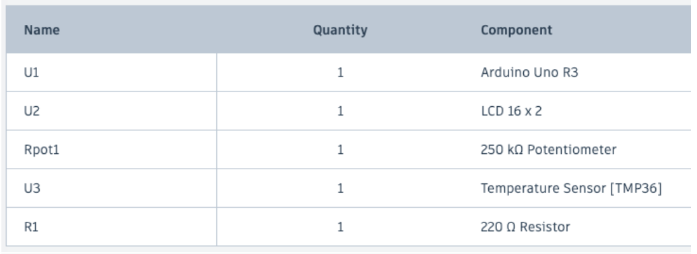
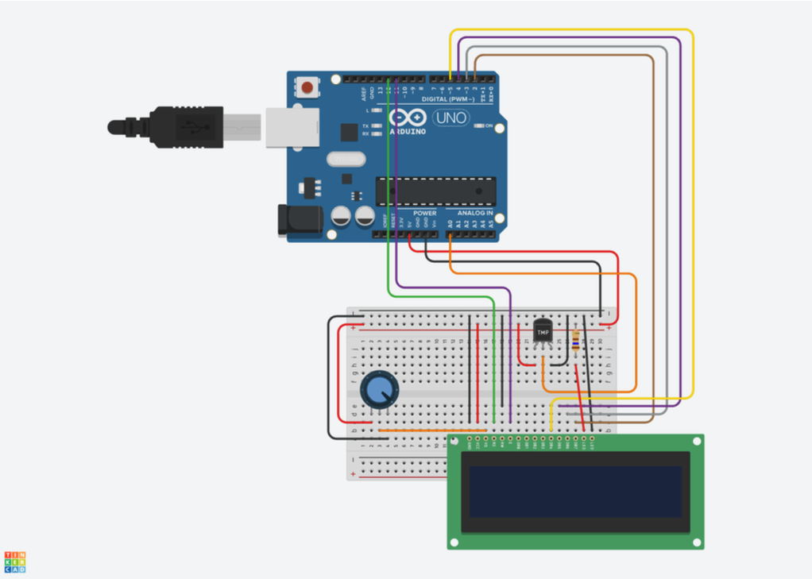

###  Features

- **Real-time Temperature Monitoring**  
- **16×2 LCD Display** with one-decimal precision  
- **Easy Wiring** via digital pins RS, EN, D4–D7  
- **Beginner-Friendly**: perfect for learning sensor and display interfacing  

###  Components



###  Wiring Diagram

Follow this wiring:

1. **LM35 Sensor**  
   - V<sub>CC</sub> → 5 V on Arduino  
   - GND → GND on Arduino  
   - V<sub>out</sub> → A0 on Arduino  

2. **LCD Module**  
   - RS → Digital 12  
   - EN → Digital 11  
   - D4 → Digital 5  
   - D5 → Digital 4  
   - D6 → Digital 3  
   - D7 → Digital 2  
   - V<sub>CC</sub> → 5 V  
   - GND → GND  



###  Source Code

```cpp
#include <LiquidCrystal.h>

// LCD pin configuration
const int rs = 12, en = 11, d4 = 5, d5 = 4, d6 = 3, d7 = 2;
LiquidCrystal lcd(rs, en, d4, d5, d6, d7);

// LM35 pin
const int lm35Pin = A0;

void setup() {
  lcd.begin(16, 2);
  lcd.print("Thermometer!");
  delay(2000);
  lcd.clear();
}

void loop() {
  int analogValue = analogRead(lm35Pin);
  float voltage     = analogValue * (5.0 / 1023.0);
  float temperature = voltage * 100.0;  // °C

  lcd.setCursor(0, 0);
  lcd.print("Temp: ");
  lcd.print(temperature, 1);
  lcd.print((char)223);  // degree symbol
  lcd.print("C");

  delay(500);
}